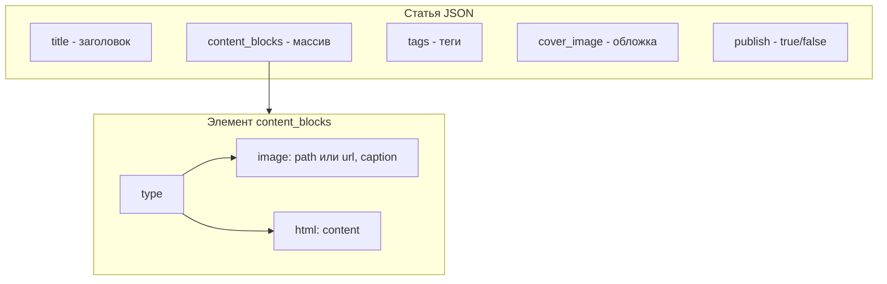
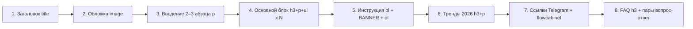
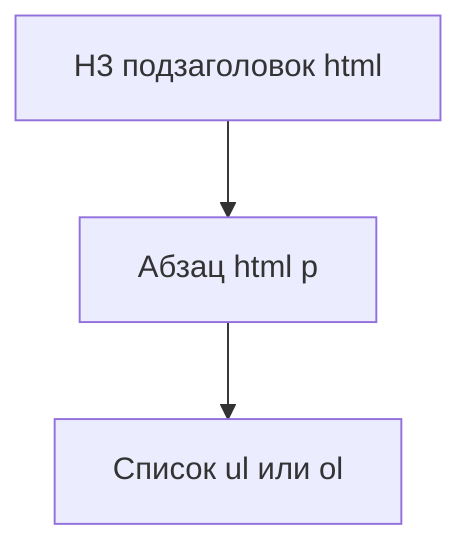
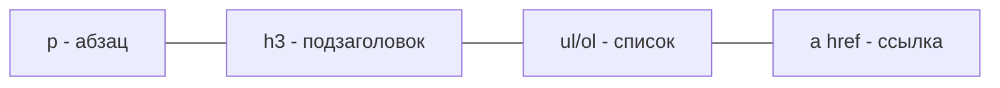

# Структура статьи в Дзене (Mermaid)

Ниже — диаграмма текущей структуры статьи для автопостинга в Дзен (формат `article_to_publish.json`, блок `autopost_zen`).

**Промпты и пошаговые инструкции по генерации статей (ключи, заголовок, текст, мета-описание, обложка):** [BLUEPRINT_ARTICLE_GENERATION_PROMPTS.md](BLUEPRINT_ARTICLE_GENERATION_PROMPTS.md).

## Модель данных статьи

## Порядок блоков в теле статьи (актуальная структура 2026)

Используется в генераторе `article_generator.py`: обложка → введение → основной блок → инструкция (с рекламным баннером после шага 3–4) → тренды 2026 → ссылки на наши каналы → FAQ.

В блоке «Инструкция» после 3–4 шага вставляется рекламный баннер (image по URL) и ссылка на сайт. Ссылки только на наши ресурсы: `https://t.me/myflowofficial`, `https://flowcabinet.ru`.

## Картинки в статье (только обложка + баннер)

В теле статьи **нет** сгенерированных картинок по секциям. Используются только:
- **Обложка** — генерируется (cover.png), вставляется первым блоком.
- **Рекламный баннер** — по URL после шага 3–4 инструкции (вставка по ссылке).

## Структура одной секции основного блока (повторяется N раз)

## Изображения в статье

- **Обложка** — единственная генерируемая картинка (cover.png), горизонтальная 16:9.
- **В теле** — только рекламный баннер по **url** (без генерации). Других картинок по секциям нет.
- Блок `type: "image"` может содержать **path** (обложка) или **url** (баннер).
- Пути к файлам ищутся в папке статьи или в `blocks/autopost_zen/articles/`.
- У каждого блока `type: "image"` обязательно поле **caption**.

Варианты вставки картинки в теле статьи (в `zen_client._add_image_in_article`, по порядку попыток):

| № | Вариант | Лог |
|---|---------|-----|
| 1 | Side button → «Загрузите файл» | `side_button+Загрузите файл` |
| 2 | Side button → «Фото» / «Изображение» | `side_button+Фото` |
| 3 | Ввод «/» → пункт «Фото» | `slash+Фото` |
| 4 | Иконки (Фото, Image, aria-label, block-add и т.д.) | `icon_selector (селектор)` |
| 5 | Кнопка «+» → «Фото» | `plus_menu` |
| 6 | Прямая загрузка в `input[type=file][accept*="image"]` | `input` |

После успешной загрузки всегда: заполнение подписи, ожидание `img` в DOM, Escape×3, End.

## HTML-элементы внутри type: html

В поле `content` блока `type: "html"` допускаются:

## Сводка полей JSON

| Поле | Тип | Обязательное | Описание |
|------|-----|--------------|----------|
| `title` | string | да | Заголовок статьи |
| `content_blocks` | array | да* | Массив блоков: `{ type, path?, url?, caption?, content? }`. Для картинок: **path** (локальный файл) или **url** (вставка по ссылке, напр. рекламный баннер). Обязательно **caption**. Генерация caption — [BLUEPRINT](BLUEPRINT_ARTICLE_GENERATION_PROMPTS.md). |
| `cover_image` | string | рекомендуется | Путь к файлу обложки (имя ищется в `assets/`, `blocks/autopost_zen/articles/`) |
| `cover_image_url` | string | альтернатива | URL обложки (если нет файла) |
| `tags` | string[] | нет | Теги для канала |
| `publish` | boolean | нет | `true` — опубликовать, `false` — черновик |

\* Либо `content_blocks`, либо устаревшее поле `content` (plain text).

Файл для правок: `blocks/autopost_zen/articles/article_to_publish.json`. Примеры: `template.json`. Генерация статей по инструкциям: [BLUEPRINT_ARTICLE_GENERATION_PROMPTS.md](BLUEPRINT_ARTICLE_GENERATION_PROMPTS.md); flowcabinet: [ARTUR_HOROSHEFF_ARTICLE_PROMPT.md](../rules/ARTUR_HOROSHEFF_ARTICLE_PROMPT.md).

## SEO и GEO: сиды и Вордстат

Перед генерацией заголовка и текста генератор:
1. По теме получает 3 поисковых «сида» (k1, k2, k3) через GRS AI (промпт из блюпринта).
2. По сидам запрашивает топ-фразы в Яндекс.Вордстате (если задан `YANDEX_WORDSTAT_TOKEN` в `.env`). Клиент: `blocks/autopost_zen/wordstat_client.py`, API: Direct API v4 (CreateNewWordstatReport, GetWordstatReport).
3. Заголовок генерируется с учётом ключевых слов (SEO, 50–65 символов, ключ в начале).
4. В текст статьи ключевые слова вплетаются органично (Entity SEO); первый абзац — прямой ответ (Zero-Click).
